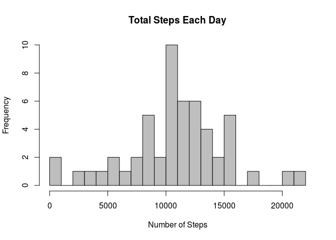
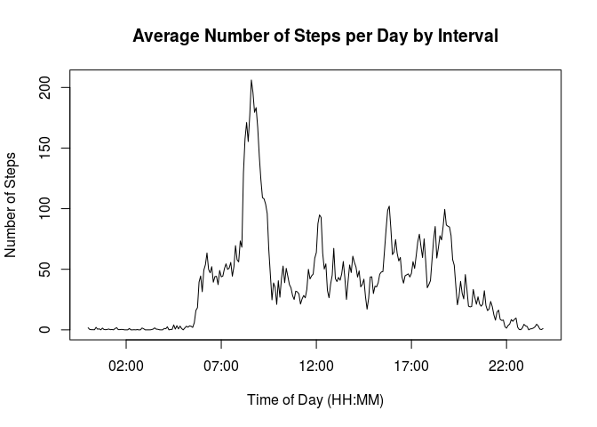
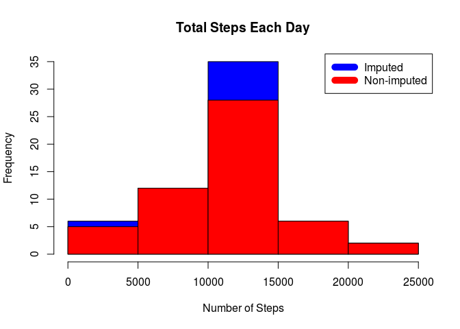
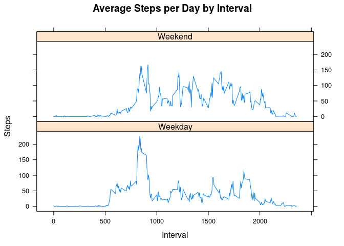

# Reproducible Research: Peer Assessment 1


##Introduction
This was the first project for the **Reproducible Research** course in Coursera's Data Science specialization track.
This assignment answer a series of questions using data collected from a [FitBit](http://en.wikipedia.org/wiki/Fitbit), i.e. a personal activity monitoring device. This device collects data at 5 minute intervals throughout the day. The data consists of two months of data from an anonymous individual collected during the months of October and November, 2012 and include the number of steps taken in 5 minute intervals each day.


##Aim of the Project
The purpose of this project was:

* loading and preprocessing data
* imputing missing values
* interpreting data to answer research questions

Set numeric notation.  From `help(options)`, $scipen$: integer. A penalty to be applied when deciding to print numeric values in fixed or exponential notation. Positive values bias towards fixed and negative towards scientific notation: fixed notation will be preferred unless it is more than ‘scipen’ digits wider; $digits$:controls the number of digits to print when printing numeric values.

```r
options("scipen" = 9999, "digits" = 2) 
```

##Load the necessary packages

```r
packages <- c("dplyr","lubridate","ggplot2")
```

Apply to each package the function require that load the package

```r
sapply(packages, require, character.only=TRUE, quietly=TRUE)
```

```
## 
## Attaching package: 'dplyr'
```

```
## The following objects are masked from 'package:stats':
## 
##     filter, lag
```

```
## The following objects are masked from 'package:base':
## 
##     intersect, setdiff, setequal, union
```

```
##     dplyr lubridate   ggplot2 
##      TRUE      TRUE      TRUE
```

## Data
The data for this assignment was downloaded from the course web
site:

* Dataset: [Activity monitoring data](https://d396qusza40orc.cloudfront.net/repdata%2Fdata%2Factivity.zip) [52K]

The variables included in this dataset are:

* **steps**: Number of steps taking in a 5-minute interval (missing
    values are coded as `NA`)

* **date**: The date on which the measurement was taken in YYYY-MM-DD
    format

* **interval**: Identifier for the 5-minute interval in which
    measurement was taken

The dataset is stored in a comma-separated-value (CSV) file and there are a total of 17,568 observations in this dataset.

## Loading the data

Download, unzip and load data into data frame `data`. 

```r
if(!file.exists("getdata-projectfiles-UCI HAR Dataset.zip")) {
        temp <- tempfile()
        download.file("http://d396qusza40orc.cloudfront.net/repdata%2Fdata%2Factivity.zip",temp)
        unzip(temp)
        unlink(temp)
}

data <- read.csv("activity.csv")
```


Check the data with `str()` and `head()`:


```r
str(data)
```

```
## 'data.frame':	17568 obs. of  3 variables:
##  $ steps   : int  NA NA NA NA NA NA NA NA NA NA ...
##  $ date    : Factor w/ 61 levels "2012-10-01","2012-10-02",..: 1 1 1 1 1 1 1 1 1 1 ...
##  $ interval: int  0 5 10 15 20 25 30 35 40 45 ...
```


```r
head(data)
```

```
##   steps       date interval
## 1    NA 2012-10-01        0
## 2    NA 2012-10-01        5
## 3    NA 2012-10-01       10
## 4    NA 2012-10-01       15
## 5    NA 2012-10-01       20
## 6    NA 2012-10-01       25
```


## What is mean total number of steps taken per day?
Sum steps by day.

```r
steps_by_day <- aggregate(steps ~ date, data, sum)
```

Create Histogram.

```r
hist(steps_by_day$steps, main = paste("Total Steps Each Day"), xlab="Number of Steps", breaks=20, col = "grey")
```

\


Calculate mean.

```r
rmean <- mean(steps_by_day$steps)
```

Calculate median.

```r
rmedian <- median(steps_by_day$steps)
```

Therefore, the `mean` is $10766.19$ and the `median` is $10765$


## What is the average daily activity pattern?

Calculate average steps for each interval for all days. 

```r
steps_by_interval <- aggregate(steps ~ interval, data, mean)
```


Add a column with the intervals converted into a more informative time class. 

```r
steps_by_interval$interval_time <- strptime(sprintf("%04d", steps_by_interval$interval), format="%H%M")
```
Check the data. 

```r
head(steps_by_interval)
```

```
##   interval steps       interval_time
## 1        0 1.717 2016-02-05 00:00:00
## 2        5 0.340 2016-02-05 00:05:00
## 3       10 0.132 2016-02-05 00:10:00
## 4       15 0.151 2016-02-05 00:15:00
## 5       20 0.075 2016-02-05 00:20:00
## 6       25 2.094 2016-02-05 00:25:00
```

Plot the Average Number Steps per Day by Interval (coded as time of the day). 


```r
plot(steps_by_interval$interval_time,
     steps_by_interval$steps, type="l", 
     xlab="Time of Day (HH:MM)", 
     ylab="Number of Steps",
     main="Average Number of Steps per Day by Interval")
```

\

Find interval with most average steps. 

```r
max_interval <- steps_by_interval[which.max(steps_by_interval$steps),]

max_interval[3] <- format(max_interval[3],"%H:%M")

max_interval
```

```
##     interval steps interval_time
## 104      835   206         08:35
```

Therefore, the 5-minute interval, on average across all the days in the data set, containing the maximum number of steps is 835 corresponding to 08:35.

## Imputing missing values. Compare imputed to non-imputed data.
Missing data needed to be imputed. Only a simple imputation approach was required for this assignment. 
Missing values were imputed by inserting the average for each interval. Thus, if interval 10 was missing on 10-02-2012, the average for that interval for all days (0.1320755), replaced the NA. 

```r
incomplete <- sum(!complete.cases(data))
imputed_data <- transform(data, steps = ifelse(is.na(data$steps), steps_by_interval$steps[match(data$interval, steps_by_interval$interval)], data$steps))
```

Zeroes were imputed for 10-01-2012 because it was the first day and would have been over 9,000 steps higher than the following day, which had only 126 steps. NAs then were assumed to be zeros to fit the rising trend of the data. 

```r
imputed_data[as.character(imputed_data$date) == "2012-10-01", 1] <- 0
```

Recount total steps by day and create Histogram. 

```r
steps_by_day_i <- aggregate(steps ~ date, imputed_data, sum)
hist(steps_by_day_i$steps, main = paste("Total Steps Each Day"), col="blue", xlab="Number of Steps")

#Create Histogram to show difference. 
hist(steps_by_day$steps, main = paste("Total Steps Each Day"), col="red", xlab="Number of Steps", add=T)
legend("topright", c("Imputed", "Non-imputed"), col=c("blue", "red"), lwd=10)
```

\

Calculate new mean and median for imputed data. 

```r
rmean.i <- mean(steps_by_day_i$steps)
rmedian.i <- median(steps_by_day_i$steps)
```

Calculate difference between imputed and non-imputed data.

```r
mean_diff <- rmean.i - rmean
med_diff <- rmedian.i - rmedian
```

Calculate total difference.

```r
total_diff <- sum(steps_by_day_i$steps) - sum(steps_by_day$steps)
```
* The imputed data mean is $10589.69$
* The imputed data median is $10766.19$
* The difference between the non-imputed mean and imputed mean is $-176.49$
* The difference between the non-imputed mean and imputed mean is $1.19$
* The difference between total number of steps between imputed and non-imputed data is $75363.32$. Thus, there were $75363.32$ more steps in the imputed data.


## Are there differences in activity patterns between weekdays and weekends?
Create a plot to compare and contrast number of steps between the week and weekend. There is a higher peak earlier on weekdays, and more overall activity on weekends.  

```r
# in italian
weekdays <- c("lunedì",    "martedì",   "mercoledì", "giovedì",   "venerdì")


imputed_data$dow = as.factor(ifelse(is.element(weekdays(as.Date(imputed_data$date)),weekdays), "Weekday", "Weekend"))

steps_by_interval_i <- aggregate(steps ~ interval + dow, imputed_data, mean)

library(lattice)

xyplot(steps_by_interval_i$steps ~ steps_by_interval_i$interval|steps_by_interval_i$dow, main="Average Steps per Day by Interval",xlab="Interval", ylab="Steps",layout=c(1,2), type="l")
```

\

